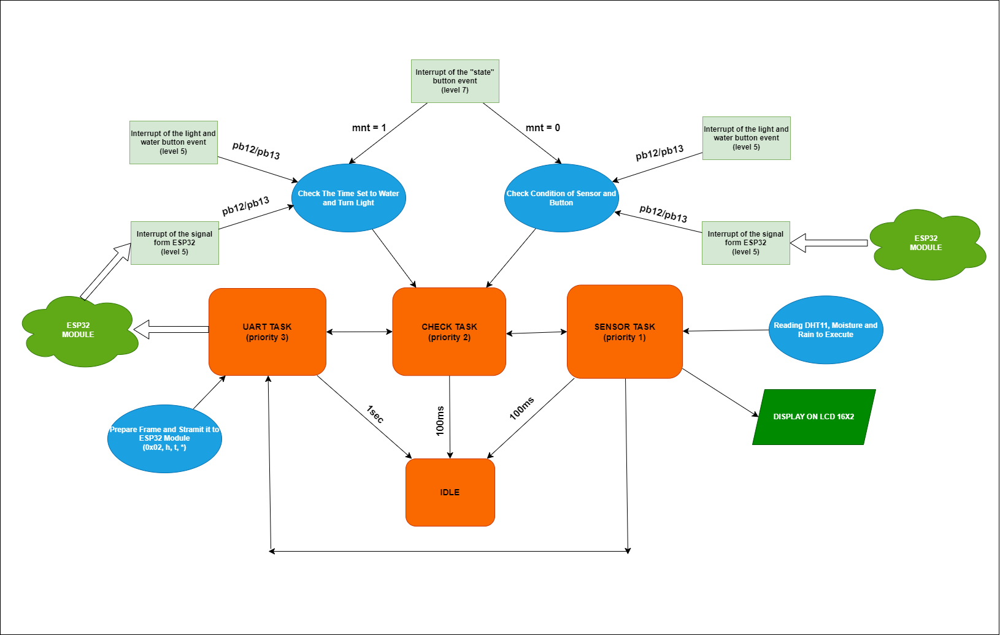
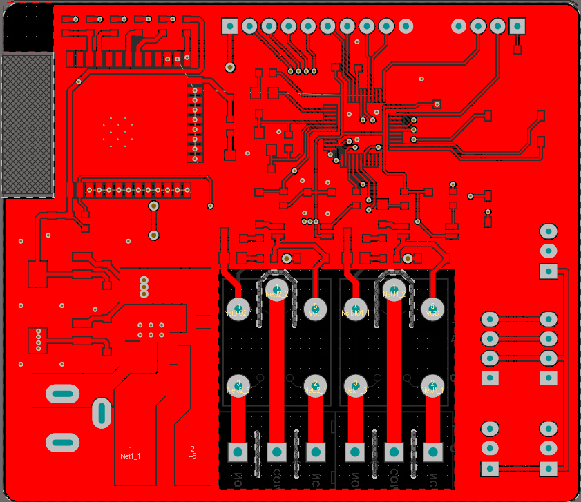
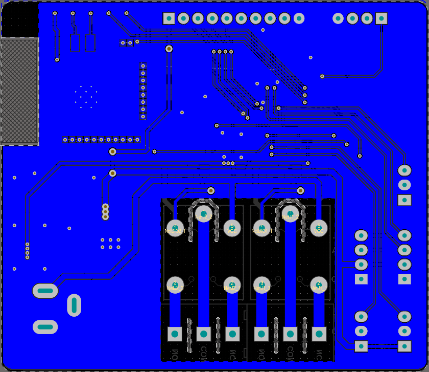
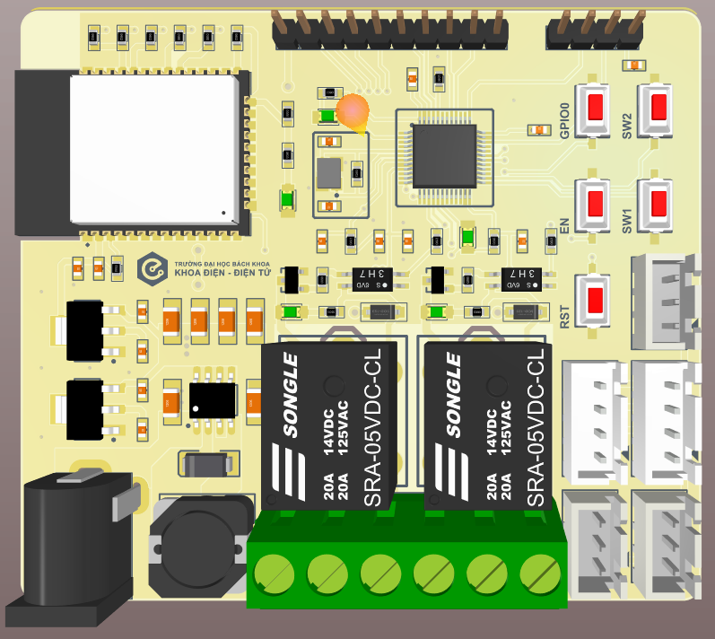
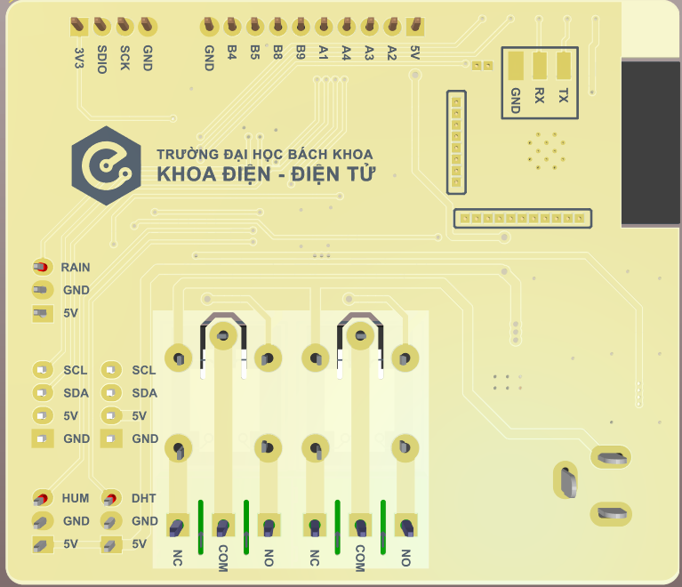

This project utilizes two different approaches: a State Machine with Interrupt-event driven, and a FreeRTOS task-driven model using counting semaphores to implement a smart garden care system. The main microcontroller used is the STM32F103, and the primary gateway is the ESP32. You can explore each section in more detail to understand the system architecture and programming methods applied.

################ SYSTEM FLOW OF FREERTOS METHOD ###################

---------------------------------------------------------------------------------------------------------------------------------------------------------------------------------------------------------------------------------------------

In addition, the team has designed a 2-layer PCB for the entire system. The hardware includes two main microcontrollers (STM32F103 and ESP32), along with the following components:

* Sensors: BH1750, Soil Moisture Sensor, DHT11, Rain sensor
* RTC module DS3231
* LCD display
* 2 relays for device control

############### TOP LAYER ##################

############### BOTTOM LAYER ##################

############### 3D VIEW ##################

